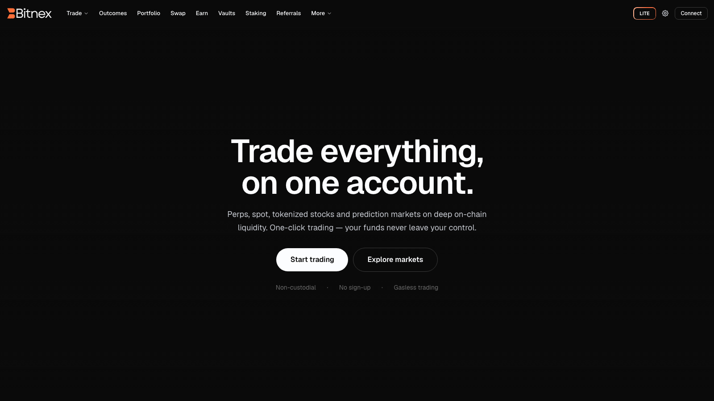

# Welcome to Bitnex

Bitnex is a non-custodial trading platform for perpetual futures and spot markets. Connect a wallet — or just an email — and trade dozens of markets with the speed and depth of a professional exchange, while your funds never leave your control. There is no sign-up form, no KYC, and once trading is enabled, every order is gasless.

Under the hood, Bitnex is built on a high-performance decentralized exchange protocol: a fully on-chain central limit order book that handles liquidity, order matching, custody and settlement. Bitnex gives you the interface — from a clean, beginner-friendly Lite view to a full Pro terminal — and the underlying protocol does the heavy lifting on-chain.

## Why Bitnex

- **Non-custodial by design.** Your assets are held by the underlying protocol's on-chain system, never by Bitnex. You stay in control of your funds at all times.
- **One-click, gasless trading.** A one-time setup creates a secure agent wallet (session key) that signs orders for you — no wallet popup per trade, no gas per order. See [Enable Trading](guides/enable-trading.md).
- **Deep on-chain liquidity.** Orders are matched on a fully on-chain central limit order book, so you get transparent, exchange-grade execution without an intermediary.
- **Lite & Pro, switchable anytime.** Start simple with [Lite mode](platform/lite-mode.md) or go full terminal with the [Pro web terminal](platform/web-terminal.md) — order book, advanced order types, TradingView-style charting and more.
- **Everything in one account.** Perps, spot, [vaults](earn/vaults.md), [staking](earn/staking.md) and [swaps](platform/swap.md) share a unified balance, all visible from your [Portfolio](platform/portfolio.md).

## Explore the docs

| Start here | What you'll find |
| --- | --- |
| [Getting Started](getting-started.md) | Connect, enable trading, deposit and place your first trade |
| [Web Terminal](platform/web-terminal.md) | A tour of the Pro trading interface |
| [Order Types](trading/order-types.md) | Market, Limit, Stop, Take Profit, Scale and TWAP orders explained |
| [Fees](platform/fees.md) | How the maker/taker fee model and volume tiers work |
| [FAQ](faq.md) | Quick answers to the most common questions |


New to perpetual futures? The [Trading section](trading/interface.md) covers the fundamentals — [margin](trading/margining.md), [funding rates](trading/funding-rate.md), [liquidation](trading/liquidation.md) and [PnL](trading/entry-price-pnl.md) — in plain language.



Bitnex is not available to U.S. persons or to residents of restricted or sanctioned jurisdictions. On first connect you will be asked to sign a message accepting the [Terms of Service](terms.md) and confirming your eligibility.

