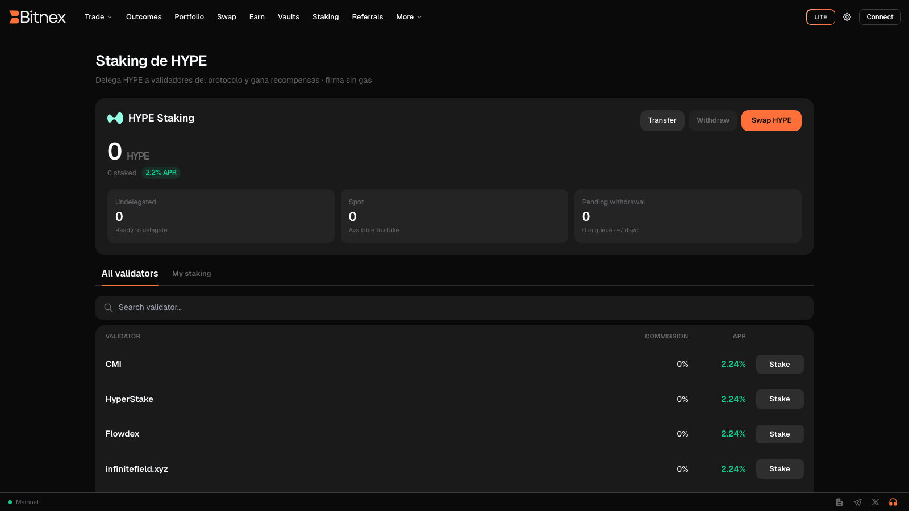

# Staking

Stake the underlying protocol's native token to network validators directly from Bitnex — no separate wallet setup, no external staking dashboard. Staking supports the security of the underlying on-chain exchange protocol, earns you rewards that accrue automatically, and can reduce your trading fees through fee-discount tiers.


Staking is fully on-chain and non-custodial. Your staked tokens are delegated to validators through the underlying protocol — Bitnex never holds them.


## How staking works

When you stake, you delegate the protocol's native token to a validator of your choice. Validators help secure the underlying protocol's network, and stakers share in the rewards generated for doing so.

- **Delegate from the app** — pick a validator, enter an amount, and confirm. The full flow happens inside Bitnex.
- **Rewards accrue automatically** — no claiming schedule to manage; your rewards compound into your staked balance over time.
- **Stay in control** — you can add to your stake, switch validators, or begin unstaking whenever you choose, subject to the protocol's timing rules (see below).

## Why stake

| Benefit | What it means |
| --- | --- |
| **Staking rewards** | Earn rewards on your staked tokens, accrued automatically by the protocol. |
| **Trading fee discounts** | Staking can qualify you for fee-discount tiers that lower your trading costs. Your current tier is shown in the app — see [Fees](../platform/fees.md). |
| **Network participation** | Your stake contributes to the security and decentralization of the underlying protocol. |

## Getting started

1. **Connect** your wallet or sign in — see [Getting Started](../getting-started.md) if you're new.
2. **Acquire the protocol's native token** — you can obtain it on Bitnex's spot markets or via [Swap](../platform/swap.md).
3. **Open Staking** under the Earn section of the app.
4. **Choose a validator** and review its details.
5. **Enter the amount** to stake and confirm.

Your staked balance, accrued rewards, and validator delegation are all visible in the Staking view and reflected in your [Portfolio](../platform/portfolio.md).

## Unstaking

Unstaking is initiated from the same Staking view. The underlying protocol defines the timing of the unstaking process — there may be a waiting or unbonding period before tokens become fully transferable again. The current timing is shown in the app when you initiate an unstake.


Staked tokens are not immediately liquid. Before staking, make sure you won't need those funds during the protocol's unstaking period. Timing rules are set by the underlying protocol, not by Bitnex.


## Things to keep in mind

- **Rewards vary.** Staking reward rates are determined by the underlying protocol and network conditions; they are not fixed or guaranteed by Bitnex.
- **Validator choice matters.** Review a validator's details before delegating.
- **Token price risk.** Staking rewards are paid in the protocol's native token, whose market price can go up or down. Staking does not protect you from price movements.
- **Fee tiers are dynamic.** Your fee-discount tier updates based on your staked amount — check the [Fees](../platform/fees.md) page in the app for your current rate.

## Related pages

- [Vaults](vaults.md) — earn by depositing into strategy vaults
- [Fees](../platform/fees.md) — fee schedule, tiers, and discounts
- [Portfolio](../platform/portfolio.md) — track balances across trading, vaults, and staking
