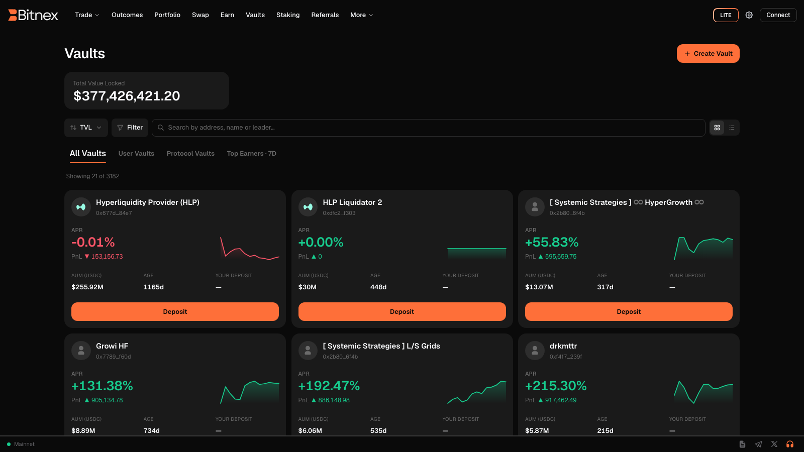

# Vaults

Vaults let you put your capital to work by following the strategies of experienced traders — without handing over custody of your funds. When you deposit into a vault, your capital is pooled on-chain and traded according to the strategy run by the vault's leader. It's copy-trading, rebuilt the non-custodial way: everything happens transparently on the underlying on-chain exchange protocol, and every vault's record is verifiable in the app.

## What is a vault?

A vault is an on-chain pool of capital managed by a **vault leader** — a trader who runs a strategy using the pooled funds. As a depositor, you share in the vault's profit and loss in proportion to your deposit.

- **On-chain and transparent** — vault balances, positions, and performance live on the underlying protocol, not on Bitnex servers. What you see is what the vault actually did.
- **Copy-trading style** — instead of mirroring individual trades in your own account, you deposit into the pool and the leader trades it as one book.
- **Non-custodial by design** — Bitnex never holds vault funds. Deposits, withdrawals, and settlement are handled entirely by the underlying protocol's on-chain system.


You don't need to enable trading or place any orders yourself to use vaults — you only need funds in your account. See [Funding Your Account](../platform/funding-account.md) if you haven't deposited yet.


## Browsing vaults

The Vaults page in the **Earn** section lists the vaults available to you. For each vault you can review:

| What to check | Why it matters |
| --- | --- |
| **Performance** | Historical returns over time, shown as a chart per vault. |
| **History** | The vault's track record — how long it has been running and how it behaved through different market conditions. |
| **TVL (Total Value Locked)** | How much capital is currently deposited. Larger TVL generally means more depositors trust the strategy, but it is not a guarantee of anything. |

Open any vault to see its full detail view before committing funds. Take the time to understand what the strategy does, how volatile its returns have been, and how it performed during drawdowns — not just its best months.

## Depositing

1. Go to **Earn → Vaults** and open the vault you're interested in.
2. Review its performance, history, and TVL.
3. Click **Deposit**, enter the amount, and confirm.

Your deposit is recorded on-chain and immediately starts tracking the vault's performance. You can monitor your vault balances alongside the rest of your account in [Portfolio](../platform/portfolio.md).

## Withdrawing

Withdrawals follow **each vault's own rules**, which are set at the protocol level and displayed on the vault's page. Before depositing, check the vault's withdrawal terms so you know when and how you can exit. When you withdraw, you receive your share of the vault's current value — your original deposit adjusted by your share of the vault's PnL since you entered.

## How returns work

Vault returns are simply a **share of the vault's trading PnL**:

- If the vault's strategy is profitable, the value of your share grows.
- If the strategy loses money, the value of your share shrinks.
- Gains and losses are distributed proportionally across all depositors.

There is no fixed yield and no guaranteed return. A vault is a live trading strategy, and its results depend entirely on how the leader trades and how markets move.

## Risks

Vaults are an investment in someone else's trading. Treat them accordingly:

- **Past performance does not predict future results.** A strong track record can end at any time.
- **You can lose funds.** If the strategy loses money, your deposit loses value — potentially significantly.
- **Strategy risk.** Vault leaders may use leverage and derivatives; see [Liquidation](../trading/liquidation.md) for how leveraged positions can be forcibly closed.
- **Liquidity considerations.** Withdrawal timing is governed by the vault's rules, so your capital may not be instantly accessible in all situations.


Only deposit what you can afford to lose. Vaults carry real risk of loss — returns depend on the vault leader's trading, and no performance history guarantees future results. Diversify, review each vault's history and withdrawal rules carefully, and never treat vault returns as fixed income.


## Related

- [Staking](staking.md) — stake the protocol's native token and earn rewards.
- [Portfolio](../platform/portfolio.md) — track your vault balances alongside your trading account.
- [Getting Started](../getting-started.md) — connect a wallet and fund your account.
