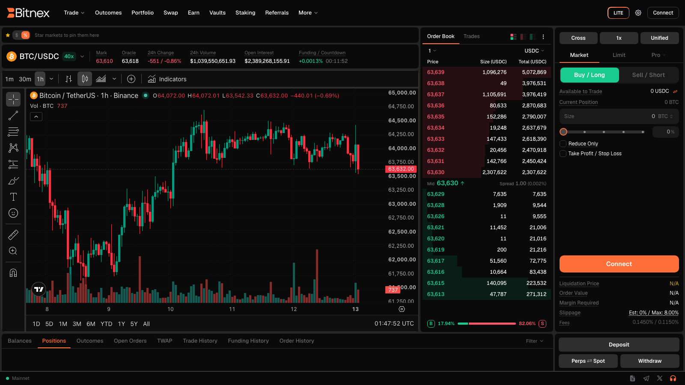

# Getting Started

Welcome to Bitnex. This guide walks you through everything you need to go from zero to your first trade: connecting a wallet, enabling trading, funding your account, and managing your first position.

Bitnex is a **non-custodial** trading platform for perpetual futures and spot markets, built on top of a high-performance decentralized exchange protocol. The underlying protocol provides the on-chain order book, matching, custody and settlement — Bitnex gives you a fast, polished interface to trade on it. There is no traditional sign-up and no KYC on Bitnex, and once set up, trading is gasless.


**Your funds never leave your control.** Assets are held by the underlying protocol's on-chain system — never by Bitnex. You can withdraw at any time without asking anyone's permission.


## Step 1 — Connect

Click **Connect** in the top-right corner of the app. You can connect in two ways:

* **Crypto wallet** — MetaMask, Coinbase Wallet, Rainbow and other popular wallets are supported.
* **Email or Google** — no wallet? Sign in with email or Google and Bitnex creates an embedded **self-custodial** wallet for you via Privy. You keep control of it; it works like any other wallet.

Either way, there is no account registration form and no KYC process on Bitnex.

## Step 2 — Accept the Terms

On your first connection, you'll be asked to sign a message with your wallet. This signature:

* Confirms you accept the [Terms of Service](terms.md) (v1.0.0).
* Confirms you are **not a U.S. person**.

Signing this message is free — it's an off-chain signature, not a transaction, and costs no gas.


Bitnex is **not available** to U.S. persons or to residents of restricted or sanctioned jurisdictions. See the [Terms of Service](terms.md) for details.


## Step 3 — Enable Trading

Next, click **Enable Trading**. This is a one-time setup that makes trading fast and popup-free:

* You sign a small set of one-time approvals on the **Arbitrum** network.
* These approvals create an **agent wallet** (a session key) that signs your orders automatically in the background — no wallet confirmation popup for every trade.
* The agent key is strictly limited: it **cannot withdraw funds**, and you can **revoke it at any time** from the app.

This is why trading on Bitnex feels as fast as a centralized exchange while remaining fully self-custodial. For a detailed walkthrough, see [Enable Trading](guides/enable-trading.md).


Brand-new account? If you click **Enable Trading** while your account is still empty, the app will first ask you to make your first deposit (Step 4) and then finish the setup automatically.


## Step 4 — Deposit USDC

Fund your trading account from inside the app:

1. Click **Deposit**.
2. Bridge **USDC from Arbitrum** into your trading account. The whole flow happens in the app.
3. Once the deposit confirms, your balance appears in your account — it is **unified across perps and spot**, so one balance serves both.

Withdrawals work the same way in reverse: USDC is sent back to your wallet on Arbitrum. See [Funding Your Account](platform/funding-account.md) for the full flow.


**Deposit USDC on the Arbitrum network only.** Sending other tokens, or USDC on a different network, may result in loss of funds.


## Step 5 — Place your first trade

You're ready to trade. Pick the view that suits you — you can switch anytime:

* **Lite** — a simple, streamlined interface: price chart, Buy/Sell, amount, leverage, and optional take-profit / stop-loss. Great for getting started. See [Lite Mode](platform/lite-mode.md).
* **Pro** — the full terminal: candlestick chart, live order book, recent trades, advanced order types, and detailed account tabs. See [The Trading Interface](trading/interface.md).

A simple first trade:

1. Select a market (e.g. BTC).
2. Choose **Buy/Long** or **Sell/Short**.
3. Enter your size and, for perps, set your leverage.
4. Review **Order Details** — estimated cost, fees, and estimated liquidation price are all shown **before** you confirm.
5. Place the order. No wallet popup — your agent wallet signs it instantly.


**Fees are always shown up front.** The exact cost of every trade appears in Order Details before you place it, and your current fee tier is visible on the [Fees](platform/fees.md) page and in the fee row of every order form.


## Step 6 — Manage your positions

Once you have an open position:

* Track it in the **Positions** tab — entry price, mark price, unrealized PnL, margin, and estimated liquidation price.
* Attach or edit a **take-profit / stop-loss** on the position at any time — full or partial size, price-based or %-based. See [Take Profit & Stop Loss](trading/tp-sl.md).
* Close part or all of the position whenever you like; realized PnL is booked on close.
* Review everything in [Portfolio](platform/portfolio.md): total equity, PnL over time, balances, and your deposits & withdrawals ledger.


Leveraged trading carries real risk. If your margin falls below the maintenance requirement, your position will be liquidated by the protocol. Size positions sensibly and use stop losses — see [Liquidation](trading/liquidation.md).


## Next steps

* Explore the full terminal in [The Trading Interface](trading/interface.md).
* Have questions? Check the [FAQ](faq.md).
