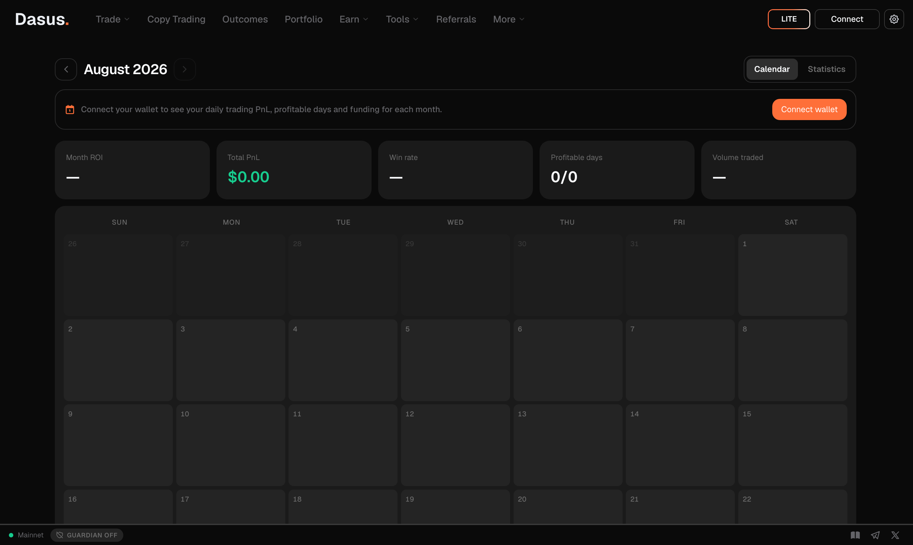

# PnL Calendar

The **Calendar** turns your trading history into a month-by-month picture: which days made money, which lost it, and what your habits actually look like once they're on a grid instead of in your memory.

## The calendar view

Each cell is one day, coloured by result, showing the day's PnL and how many trades you closed. Above the grid you get the month's summary:

- **Total PnL** and **Month ROI** — switch the view between PnL, ROI, or both.
- **Closed PnL** — realized results from positions you actually closed.
- **Profitable days** — how many of the month's trading days ended green.
- **Funding** — what perpetual funding cost or paid you over the month.
- **Profit/Loss ratio** and **cash movements** (deposits, withdrawals, transfers) for the month.

Click any day to open its detail: the trades closed that day, PnL by pair, fees, and that day's deposits and withdrawals.


A day can show PnL without any closed trade — that's your **open positions** moving with the market. The day detail says so explicitly, so you never confuse mark-to-market movement with realized profit. See [Entry Price & PnL](../trading/entry-price-pnl.md).


## The statistics view

The **Statistics** tab is the same data read as a track record:

| Metric | What it tells you |
| --- | --- |
| **PnL / ROI (30d)** and the account value curve | Recent performance and the equity path that produced it |
| **Win rate · Wins / losses** | How often you're right |
| **Avg win · Avg loss · Expectancy** | Whether being right pays more than being wrong costs — expectancy is the average result per trade |
| **Profit factor · Sharpe ratio** | Quality of returns, not just their size |
| **Max drawdown** | The worst peak-to-trough fall your account went through |
| **Best / worst trade · Most and least profitable pair** | Where your results actually come from |
| **Long / short split · Avg and max leverage** | Your directional bias and how much risk you take to get it |
| **Volume traded · Fees paid** | Activity and its cost — see [Fees](fees.md) |


**Expectancy and drawdown matter more than win rate.** A 70% win rate with an average loss twice the size of the average win loses money. Read the two together.


## Sharing a month

**Share** turns the month (or a single day) into an image card with your PnL or ROI, ready to post. If you have a [referral code](referrals.md), the card carries your link, so a shared result can bring in referred traders.


Pick what the card shows — **PnL**, **ROI**, or both — from the view selector before sharing.


## Related pages

- [Portfolio](portfolio.md) — equity, balances and the full activity tables
- [Entry Price & PnL](../trading/entry-price-pnl.md) — how each PnL figure is calculated
- [Fees](fees.md) — what your trading actually cost
