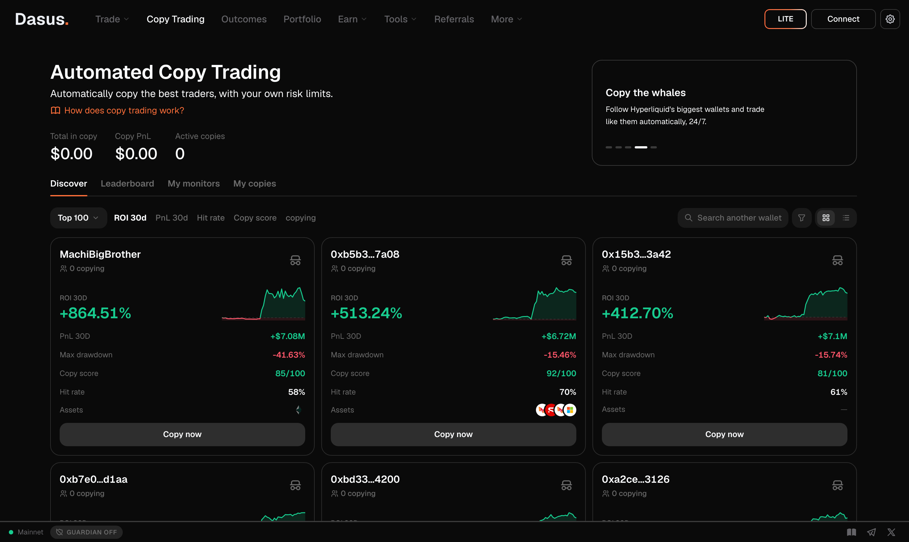

# Copy Trading

Copy top traders automatically from Dasus: the engine mirrors their trades into **your** account 24/7, proportional to your allocation, under your own risk limits.


**Risk warning.** Copy trading places **real** orders in your account and can generate losses, including the **partial or total** loss of the capital you allocate. Past performance does not guarantee future results. Dasus is **not** a fund manager and **not** a financial advisor: the decision to copy a trader is exclusively yours.


## How it works (in 5 steps)

1. **Pick a trader** — from the Top 100, the Leaderboard, or by pasting any protocol wallet address (Snipers). Every profile shows real statistics: PnL, ROI, max drawdown, Sharpe, win rate, open positions and history.
2. **Configure your copy** — allocation in USDC, Copytrade or Inverse mode, max leverage, max entry deviation, auto-stop on loss, and optionally which assets to copy or whether to seed the positions the trader already has open.
3. **Sign the terms** (once per wallet; the message you sign names the document version, its SHA-256 hash, the dasus.xyz domain, your wallet and an expiry, so it can't be reused anywhere else) and **approve the copy agent key** — a key that can **only trade, never withdraw**, and that you can revoke on-chain whenever you want. If you already have one from a previous copy, "Use existing" asks for no signature at all.
4. **The engine copies 24/7** — it mirrors the trader's **new** position changes (opens, increases, reductions, closes **and their TP/SL**), proportional to your allocation. Every copied order is tagged with a "Copy" chip in your tables.
5. **Pause, adjust or stop whenever you want.** Stopping a copy **does not close your open positions** — they stay in your account and you manage them from your Portfolio.

## What you sign, and why

- **Risk disclosure** — a gas-free signature of the full text, once per wallet and version. It records your acceptance; it authorizes nothing on-chain.
- **Copy agent key** — authorizes a named key ("bitnex-copy") to place and cancel orders for you. By protocol design it cannot withdraw or approve fees.
- **Platform fee** — the only signature that lets Hyperliquid deduct Dasus's fee from your orders. It is per builder address, capped (max 1%), and asked once the first time you copy. Without it Hyperliquid rejects any order carrying the fee; if that ever happens, the engine retries the copy without the fee rather than losing it.

## Do I need to keep my wallet connected?

**No.** The copy runs on Dasus servers using the agent key: you don't need your wallet connected, the page open, or your computer switched on. The agent key is stored **encrypted** (AES-256-GCM) and only the engine can use it — and only to trade, never to withdraw funds.

## How your copies are sized

Copies are **proportional**: if the trader risks 10% of their equity on a trade, your copy risks 10% of your allocation. Example: a trader with $500,000 of equity opens a $50,000 position (10%) → with a $100 allocation, your copy opens about $10.

* **Per-order minimum:** the protocol requires roughly $10 of notional per order. If your allocation is very small relative to the trader's equity, some copies won't reach the minimum and will be skipped (you'll see it under "Last activity").
* **Minimum balance:** you need at least **$20 USDC** in your perps account to activate a copy, and your allocation cannot exceed your balance.
* **Not enough margin:** if your account runs out of margin, copies simply **don't execute** until you have balance again. Nothing breaks: the engine keeps watching and resumes once margin is available.

## Risk controls

| Control | What it does |
| --- | --- |
| **Max leverage** (1–40×) | Your copies mirror the trader's leverage up to this cap, and your copied position never exceeds allocation × leverage. |
| **Max entry deviation** (1–20% or unlimited) | If by the time your copy executes the price has already moved against you by more than this percentage versus the trader's entry, that copy is skipped. *Does not apply when seeding already-open positions.* |
| **Auto-stop on loss** (−10 / −25 / −50%) | If the copy (only what the engine opened) loses that share of your allocation between realized and unrealized PnL, it **closes the copied positions and stops** — it is a full stop, not a pause: nothing is copied again until you start it back. Your own positions are never touched. |
| **Assets** | Copy every market the trader touches, or only the ones you select. |
| **Copy already-open positions** | On start, opens the trader's current positions proportionally **at the current price**. |

## Inverse mode

In Inverse mode, when the trader opens a long you open a **short** (and vice versa). Closes always act on **your** real position, and the trader's TP/SL are inverted with the matching logic: their take profit becomes your stop loss and vice versa (same price barrier, opposite position). The same risk limits apply.

## What is copied and what isn't

* ✅ Opens, increases, reductions and closes of **perps** — on the main dex **and on HIP-3 builder markets** (stocks, gold, etc.). The trader's equity is measured across all of their markets, so 100%-stocks traders are copied correctly.
* ✅ **The trader's TP/SL** (mirrored, and updated if they move them).
* ✅ A full close by the trader means a full close of your copy.
* ❌ Spot and staking.
* ❌ The trader's **historical** portfolio — only changes from the moment you activate the copy, unless you enable "copy already-open positions".

## The once-only rule: your close is final

A copied position is opened **once**. If **you** close it yourself (from your Portfolio, the terminal, or "Close All"), the engine treats that as your final decision for that market: **it will never reopen it** inside that subscription — not even if the trader adds to it, flips it, or you re-run "copy already-open positions". "Last activity" shows the market as *closed by you*. To copy that market again, stop the subscription and create a new one.

## What happens when… (scenario map)

**The trader you copy…**

| Event | Your copy |
|---|---|
| Opens a new position | Opens proportionally, within your limits. |
| Adds to a position | Adds to your copied size. The "worst entry" check compares against the price of *that* add, not the trader's average entry. |
| Reduces part | Reduces your copied size proportionally, never more than what the copy opened. |
| Closes everything | Closes **only what this copy opened** — never a position you opened yourself, nor another copy's. |
| Flips (long → short) | Closes your copied size and opens the new side, unless you had closed that market by hand. |
| Sets or moves a TP/SL | It is mirrored on your copied size (one TP and one SL at most). In Inverse mode they swap. |

**You…**

| Action | What happens |
|---|---|
| Close a copied position by hand | That market is **locked for that copy**: it will not be reopened by later signals. Your close is final. |
| Reduce part of a copied position by hand | The copied size is scaled down to match; nothing is locked. |
| Hold your own position in the same market | It coexists. The engine only ever touches the size it opened; your own size is never closed and never counts toward the copy's stop. |
| Copy trader A (long BTC) and trader B (short BTC) | Hyperliquid nets both into one BTC position in your account, possibly near zero. The engine tracks each copy separately and closes each one when its trader does. The setup wizard warns you before you allocate capital to opposite sides. |
| Run out of free margin | Hyperliquid rejects the order; the reason shows on your copy card and the next signal is tried again. |

## Pausing and stopping

Both open a dialog that lists every position **this copy opened**, with its size, entry, current price and PnL. For each one you choose:

- **Close** — a market order for the size the copy opened. The engine executes it within seconds, with the agent key it already holds, even though the copy is already paused or stopped.
- **Keep** — the position stays in your account and is yours to manage from Portfolio.

While a copy is **paused**, nothing is opened *or closed* for it, and its loss protection is not evaluated. Resuming follows the trader from that moment on; what they did during the pause is not replayed. If a copy was paused by its loss protection, resuming resets the protection counter.

**Stopping** removes the copy from your list immediately. Any TP/SL the engine mirrored for it is cancelled first, then your requested closes are executed, and only then is the copy (and its encrypted key) deleted.

## Exchange minimum and skipped positions

Hyperliquid requires roughly **$10 of value per order**. Your copies are scaled by *your allocation ÷ the trader's equity*, so with a small allocation against a large trader, their smaller positions can scale below that minimum — those are **skipped** (never opened) and listed one by one in "Last activity" with the reason. Raising the allocation is the only way to include them.

## Reliability

* If the exchange rate-limits an order (a temporary "429"), the engine retries automatically with increasing pauses; if it still can't get through, the pending part is completed on the next cycle — **without duplicating** what was already opened.
* "Copy already-open positions" is **idempotent**: re-running it only opens what is missing to reach the target, never doubles an existing copy.
* If the engine cannot read part of a trader's account on a given cycle, that trader is skipped for that cycle entirely — an incomplete reading is never interpreted as "the trader closed everything".

## Delays and price differences

The engine polls traders in cycles of roughly 5 seconds. Between the trader's trade and your copy there can be **delays and price differences** (servers, network, protocol execution): your results may differ from the trader's, potentially by a lot. Max entry deviation exists precisely to bound this effect.

## Fees

Copied orders pay the standard Dasus fee (builder fee) for the copy trading surface — by default, the same rate as the Pro terminal. There is no management fee and no performance fee: we do not take a percentage of your profits.

## Pausing, stopping and revoking

* **Pause**: the engine stops opening **and** closing. Everything becomes 100% your responsibility: if the trader closes, your account does **not**. Your positions and TP/SL stay exactly as they are.
* **Stop and delete**: removes the copy and its encrypted agent key from the server. Your open positions remain — manage them from your Portfolio (the app asks you to confirm and reminds you of exactly this before stopping).
* **Revoke on-chain**: you can invalidate the agent key at any time from the protocol (it appears under its on-chain name, `bitnex-copy`, kept unchanged so approvals signed before the rebrand stay valid).

## Terms and conditions (the signed text)

When you activate copy trading you sign the following canonical text with your wallet (version `v2-2026-08`). Your wallet shows you the full text at the moment of signing, and the signature is stored as cryptographic proof of your acceptance.

> **Dasus Copy Trading — Risk acceptance (v2-2026-08)**
>
> By signing, I declare and accept that:
>
> 1. Copy trading places REAL orders in my account automatically, and I may lose my allocated capital PARTIALLY or ENTIRELY, just as the copied trader may.
> 2. Dasus is NOT a fund manager, is NOT a financial advisor, and NOTHING on the platform constitutes a recommendation or investment purpose. The decision to copy a trader is EXCLUSIVELY mine; for real advice I must consult qualified financial professionals.
> 3. There may be DELAYS or price differences between the trader's trade and my copy (servers, network, protocol execution); my results may differ from the trader's, potentially significantly.
> 4. Dasus and any related party are NOT liable for losses, adjustments, configuration changes, service interruptions, execution errors, or any other damage arising from the use of copy trading.
> 5. Past performance of the copied trader does NOT guarantee future results.
> 6. Stopping a copy does NOT close my open positions: managing them is my responsibility.
> 7. The agent key I authorize can only trade (never withdraw) and I can revoke it on-chain whenever I want.

## Frequently asked questions

**What happens if I close my browser or disconnect my wallet?**
Nothing: the copy keeps running on the server with the agent key. Connecting your wallet is only needed to create, adjust, pause or stop copies.

**If the trader closes their position, does mine close by itself?**
Yes, as long as the copy is ACTIVE. While paused, no — everything is up to you.

**Can I copy several traders at once?**
Yes, each copy is independent, with its own allocation and limits.

**Can I trade my account manually while copying?**
Yes. The engine only touches what it opened (it keeps its own record of lots); your personal positions don't trigger the auto-stop and aren't closed by the copy. Note that they do share the same account margin.

**Why wasn't one of the trader's trades copied?**
Check "Last activity" on your copy. The usual reasons are: entry deviation exceeded, notional below the minimum (~$10), the allocation × leverage cap reached, or not enough margin.

**What does the /100 score measure?**
It's a transparent heuristic over real data: 30-day returns (35%), consistency/Sharpe (20%), drawdown risk (20%), win rate (15%) and activity (10%). It is not an investment recommendation.
