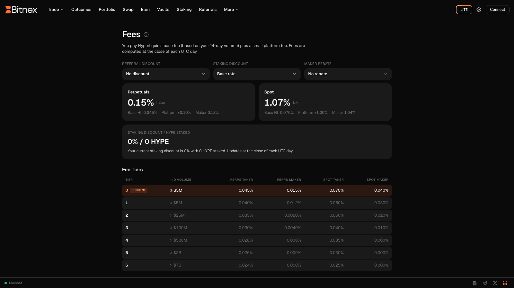

# Fees

Bitnex uses a transparent, volume-based fee model. Every trade pays a single all-in trading fee that combines the base fee of the underlying on-chain exchange protocol with a small Bitnex platform fee — there are no hidden charges, no deposit fees from Bitnex, and no fee surprises after the fact. The exact cost of every order is shown to you **before** you confirm it.


Fee rates are subject to change and vary by tier and market type (perps vs. spot). Always refer to the **Fees page inside the app** for the current, complete fee schedule and your live tier — that is the single source of truth.


## Maker vs. taker

Like every professional exchange, Bitnex distinguishes between orders that **add** liquidity to the order book and orders that **remove** it:

| Role | What it means | Typical orders |
| --- | --- | --- |
| **Maker** | Your order rests on the order book and waits to be filled. It "makes" liquidity available to others. | Limit orders that don't cross the spread, post-only orders |
| **Taker** | Your order executes immediately against resting orders, "taking" liquidity from the book. | Market orders, limit orders that cross the spread, triggered stop orders |

Maker fees are lower than taker fees, because makers provide the liquidity that keeps markets deep and spreads tight. If you want to minimize fees, use limit orders that rest on the book — or the **post-only** time-in-force option, which guarantees your order will never execute as a taker. See [Order Types](../trading/order-types.md) for details.


A limit order is not automatically a maker order. If your limit price crosses the current spread, it fills immediately and is charged the **taker** rate. Only orders that rest on the book earn the maker rate.


## Volume-based tiers

Your fee rate depends on your **rolling 14-day trading volume**. The more you trade, the lower your rate:

- Tiers are calculated automatically from your trailing 14-day volume — no application or manual upgrade needed.
- Higher tiers unlock progressively lower maker and taker rates.
- Your **current tier**, your 14-day volume, and the full tier table are displayed on the Fees page in the app.
- Perps and spot markets have their own rate schedules, both shown in the same table.

## What's included in the rate

The rates you see in the app are **all-in**. Each displayed rate already includes:

1. The base trading fee of the underlying on-chain exchange protocol, and
2. The Bitnex platform fee, which funds the development and operation of the interface.

You will never be charged more than the rate displayed at the time of your order. There is no separate "interface fee" line added afterwards.


**Funding payments are not fees.** On perpetual markets, funding is exchanged peer-to-peer between longs and shorts — Bitnex does not receive any part of it. See [Funding Rate](../trading/funding-rate.md).


## Where to see your fees

You never have to guess what a trade will cost. Fees are surfaced in three places:

- **Fees page** — the full maker/taker schedule for perps and spot, your current tier, your 14-day volume, and any active discounts.
- **Order form** — every order form (Lite and Pro) includes a fee row showing the rate that applies to your order.
- **Order Details** — before you confirm any trade, the Order Details summary shows the exact estimated cost of that specific order, including fees.

After execution, the fee actually paid on each fill is recorded in your [Trade History](portfolio.md).

## Fee discounts

Two ways to pay less:

### Referral discount

If you joined Bitnex through a referral link or code, you receive a discount on your trading fees. Referrers also earn a share of the fees their invitees pay. See [Referrals](referrals.md).

### Staking discount

Staking the protocol's native token can reduce your trading fees through fee-discount tiers — the more you stake, the larger the potential discount. Staking is available directly from the app; see [Staking](../earn/staking.md).


Discounts stack with your volume tier: your effective rate is your tier rate adjusted by any referral or staking discount you qualify for. Your effective rate is always the one shown in the order form and Order Details.


## Other costs to know about

- **Gasless trading** — once trading is enabled, placing, modifying, and cancelling orders costs no gas. See [Enable Trading](../guides/enable-trading.md).
- **Deposits & withdrawals** — Bitnex does not charge deposit fees. Bridging USDC from Arbitrum incurs standard network gas on the Arbitrum side; withdrawals back to Arbitrum may incur a small protocol-level processing cost, shown before you confirm. See [Funding Your Account](funding-account.md).
- **Liquidations** — closing a position via liquidation is handled by the underlying protocol and can be significantly more costly than closing it yourself. Manage risk proactively; see [Liquidation](../trading/liquidation.md).

## FAQ

**Do I pay fees on both open and close?**
Yes — each execution (opening, adding, reducing, closing) is a fill and is charged at the applicable maker or taker rate.

**Are TWAP and Scale orders charged differently?**
No special surcharge — each sub-order or slice is charged as a normal fill at your maker/taker rate depending on how it executes. See [TWAP](../trading/twap.md) and [Scale Orders](../trading/scale-orders.md).

**Does my tier reset?**
Tiers don't reset on a calendar schedule — they follow your rolling 14-day volume continuously, moving up or down as your volume changes.

For anything not covered here, check the [FAQ](../faq.md) or the Fees page in the app.
