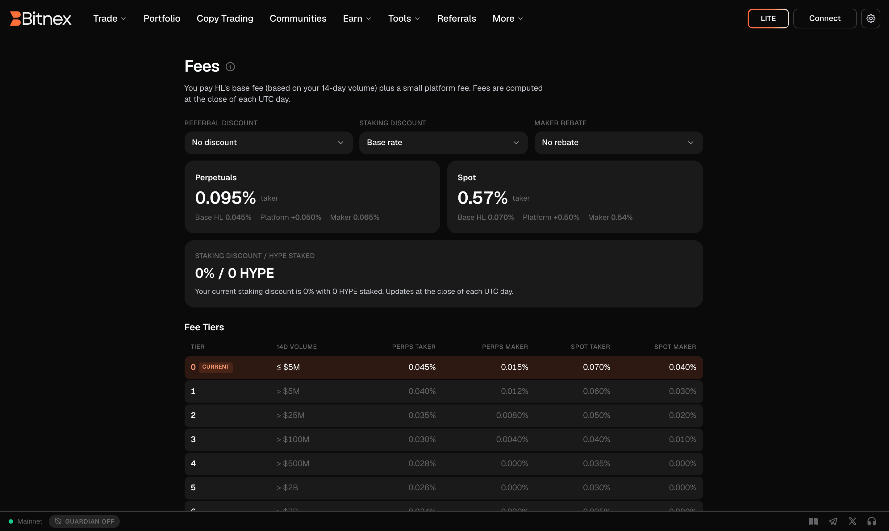

# Fees

Dasus uses a transparent, volume-based fee model. Every trade pays a single all-in trading fee that combines the base fee of the underlying on-chain exchange protocol with a small Dasus platform fee — there are no hidden charges, no deposit fees from Dasus, and no fee surprises after the fact. The exact cost of every order is shown to you **before** you confirm it.


Fee rates are subject to change and vary by tier and market type (perps vs. spot). Always refer to the **Fees page inside the app** for the current, complete fee schedule and your live tier — that is the single source of truth.


## Maker vs. taker

Like every professional exchange, Dasus distinguishes between orders that **add** liquidity to the order book and orders that **remove** it:

| Role | What it means | Typical orders |
| --- | --- | --- |
| **Maker** | Your order rests on the order book and waits to be filled. It "makes" liquidity available to others. | Limit orders that don't cross the spread, post-only orders |
| **Taker** | Your order executes immediately against resting orders, "taking" liquidity from the book. | Market orders, limit orders that cross the spread, triggered stop orders |

Maker fees are lower than taker fees, because makers provide the liquidity that keeps markets deep and spreads tight. If you want to minimize fees, use limit orders that rest on the book — or the **Post Only** time-in-force option, which guarantees your order will never execute as a taker. See [Order Types](../trading/order-types.md) for details.

At the top tiers, accounts that supply a meaningful share of the book's maker volume qualify for **maker rebates** from the protocol — a negative maker fee, i.e. you get paid to provide liquidity. The rebate tiers are listed on the Fees page.


A limit order is not automatically a maker order. If your limit price crosses the current spread, it fills immediately and is charged the **taker** rate. Only orders that rest on the book earn the maker rate.


## Volume-based tiers

Trading more lowers **both halves** of what you pay, automatically — no application, no manual upgrade. The two halves use different windows, which is why the Fees page shows two volume numbers:

| | Base protocol fee | Dasus platform fee |
| --- | --- | --- |
| **Window** | Rolling **14-day** volume | Rolling **30-day** volume |
| **Tiers** | Tier 0 → Tier 6 (from ≤ $5M up to > $7B) | 7 steps, from $0 up to > $7B |
| **Where you see it** | Fee Tiers table, with your current tier highlighted | "Platform fee by tier" table, with your step highlighted |

Perps and spot have their own schedules, both shown side by side. For the base protocol fee, a master account and its [sub-accounts](sub-accounts.md) are counted together, so splitting capital across sub-accounts never costs you a tier.

### Platform fee by tier

The Dasus platform fee is **not flat**. It steps down with your 30-day volume:

| Your 30-day volume | Platform fee |
| --- | --- |
| $0 | Base rate |
| > $5M | −15% |
| > $25M | −30% |
| > $100M | −45% |
| > $500M | −60% |
| > $2B | −70% |
| > $7B | −75% |

**Maker orders (Post Only) pay 40% of the taker platform fee** — a further 60% off — and the two discounts combine. A high-volume maker therefore pays a small fraction of the base platform rate.


Without a volume figure to go on, you are charged the **base** rate — a discount is never assumed. Your live 30-day volume and the exact rate that will apply are shown on the Fees page and in the fee row of the order form.


## What's included in the rate

The rates you see in the app are **all-in**. Each displayed rate already includes:

1. The base trading fee of the underlying on-chain exchange protocol, and
2. The Dasus platform fee, which funds the development and operation of the interface.

You will never be charged more than the rate displayed at the time of your order. There is no separate "interface fee" line added afterwards. Volume tiers and discounts are recomputed at the **close of each UTC day**, so a tier you reach today applies from the next daily roll.

### Platform fee by mode

The Dasus platform fee depends on the interface you trade from:

| Mode | Perps (taker) | Spot (taker) |
| --- | --- | --- |
| **Pro** | 0.050% | 0.50% |
| **Lite** | 0.10% | 1.00% |

Maker orders (Post Only) pay **40%** of these rates, and volume-based tiers can lower them further. Lite trades at a higher platform rate because it bundles the simplified experience; you can switch to Pro at any time from the same account — same balance, same positions, lower platform fee. Both rates are always visible side by side on the in-app Fees page, and the fee row of every order form shows the exact rate applied to *your* order before you confirm.

**[TWAP](../trading/twap.md) orders pay no platform fee** — the protocol's native TWAP action does not carry builder codes, so a TWAP costs you only the base protocol fee on each slice.


**Funding payments are not fees.** On perpetual markets, funding is exchanged peer-to-peer between longs and shorts — Dasus does not receive any part of it. See [Funding Rate](../trading/funding-rate.md).


## Where to see your fees

You never have to guess what a trade will cost. Fees are surfaced in three places:

- **Fees page** — the full maker/taker schedule for perps and spot, your current tier, your 14-day volume, and any active discounts.
- **Order form** — every order form (Lite and Pro) includes a fee row showing the rate that applies to your order.
- **Order Details** — before you confirm any trade, the Order Details summary shows the exact estimated cost of that specific order, including fees.

After execution, the fee actually paid on each fill is recorded in your [Trade History](portfolio.md).

## Fee discounts

Two ways to pay less:

### Referral discount

The protocol applies a **referral discount on its base fee** to accounts registered under a referrer. The Fees page includes it in the rate calculator so you can see the effect on your own rate, and shows whether it is currently active for your account.

Referring traders on Dasus is a separate programme: referrers earn a share of the platform fee their invitees generate — see [Referrals](referrals.md).

### Staking discount

Staking HYPE reduces your base trading fee through staking tiers — the more you stake, the larger the discount:

| Tier | HYPE staked | Fee discount |
| --- | --- | --- |
| Wood | > 10 | 5% |
| Bronze | > 100 | 10% |
| Silver | > 1,000 | 15% |
| Gold | > 10,000 | 20% |
| Platinum | > 100,000 | 30% |
| Diamond | > 500,000 | 40% |

Your current tier and staked amount are shown on the Fees page, and update at the close of each UTC day. Staking is available directly from the app — see [Staking](../earn/staking.md).


Discounts stack with your volume tier: your effective rate is your tier rate adjusted by any referral or staking discount you qualify for. Your effective rate is always the one shown in the order form and Order Details.


## Other costs to know about

- **Gasless trading** — once trading is enabled, placing, modifying, and cancelling orders costs no gas. See [Enable Trading](../guides/enable-trading.md).
- **Deposits & withdrawals** — Dasus does not charge deposit fees. Bridging USDC from Arbitrum incurs standard network gas on the Arbitrum side; withdrawals back to Arbitrum may incur a small protocol-level processing cost, shown before you confirm. See [Funding Your Account](funding-account.md).
- **Liquidations** — closing a position via liquidation is handled by the underlying protocol and can be significantly more costly than closing it yourself. Manage risk proactively; see [Liquidation](../trading/liquidation.md).

## FAQ

**Do I pay fees on both open and close?**
Yes — each execution (opening, adding, reducing, closing) is a fill and is charged at the applicable maker or taker rate.

**Are TWAP and Scale orders charged differently?**
Scale orders are not: each sub-order is a normal fill at your maker/taker rate. **TWAP orders carry no Dasus platform fee at all** — the protocol's TWAP action does not support builder codes, so on a TWAP you only pay the base protocol fee. See [TWAP](../trading/twap.md) and [Scale Orders](../trading/scale-orders.md).

**Does my tier reset?**
Tiers don't reset on a calendar schedule — they follow your rolling volume continuously (14 days for the base protocol fee, 30 days for the platform fee), moving up or down as your volume changes.

For anything not covered here, check the [FAQ](../faq.md) or the Fees page in the app.

## Outcome (prediction) markets — from Aug 16, 2026

Following Hyperliquid's HIP-4 network upgrade, outcome markets charge protocol fees configured by each market's deployer:

- **Opening a position is free** — the protocol fee is charged **only when you close or get liquidated**.
- The average outcome fee is **about half** of a regular market's (for example, a Tier-0 taker pays ~0.07% on close).
- The exact scale is set per market by its deployer.
- The Dasus platform fee applies per order as usual and is always shown in the order form before you confirm.
