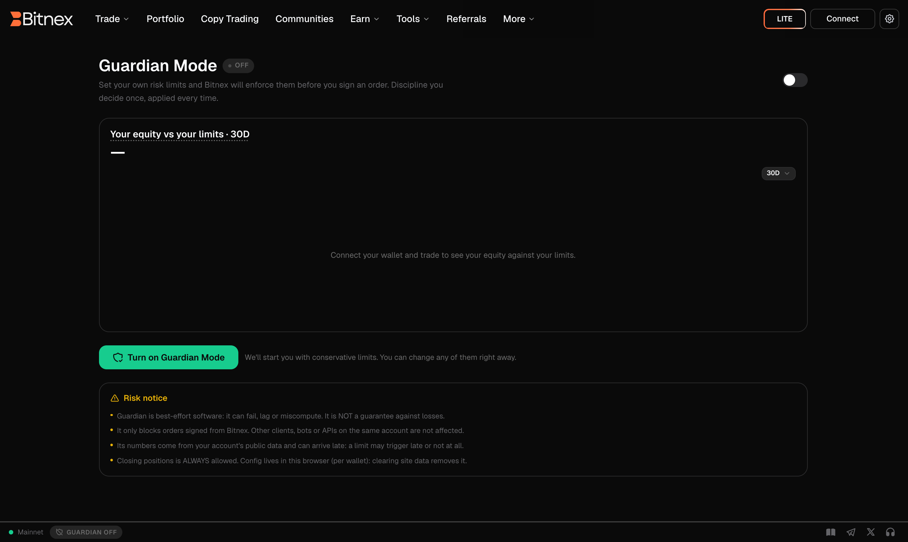

# Guardian Mode

## What it is

Guardian Mode lets you set your own risk limits, and Dasus enforces them **before you sign an order**. You decide the rules once, when you're calm; they apply every time, including the times you'd rather they didn't.


**Guardian is a discipline tool, not account custody.** Your funds live on the underlying protocol and you can always trade them from another client. What Guardian guarantees is that **no order that breaks your rules is signed from Dasus**, and that **your copy trading does not open new copies against them**. It never promises "you can't lose more than X".


**Guardian never blocks you from closing a position, cancelling an order, adding a stop, withdrawing or revoking a key.** Only orders that open or increase exposure are evaluated. A limit that traps you in a trade would be worse than no limit at all.

## Turning it on

Guardian has its own page at **/guardian**. Activation is four sliders and one checkbox: max leverage, daily loss, max drawdown and your **unlock delay**. Every slider starts at its strictest value; loosening is a decision you make, not a default. Nothing turns on until you accept the terms.

At that moment Guardian anchors your **starting capital** — the account value at activation — and measures your drawdown against it, like a funding-firm account. You can re-anchor at any time from the page (a conscious action, never automatic).

Your policy is **per wallet** (each account, sub-account or vault you trade from has its own) and it is **saved on our server with a version number and a full history**. Clearing your browser or switching devices does not remove it, and an active pause survives. If you are not signed in, the local copy applies until you sign in again; the page tells you which one is in force.

## The rules

| Rule | What it does | Measured from |
| --- | --- | --- |
| **Max leverage** | Blocks any new order above this leverage | The order you're placing |
| **Daily loss** | Once you're down this much today, only closing until the next reset | Your PnL since **00:00 UTC**, net of deposits and withdrawals |
| **Max drawdown** | Only closing while your account sits this far below your anchor | PnL since the anchor, net of deposits and withdrawals |
| **Voluntary pause** | No new exposure until it ends. **Irrevocable** once set | The date you chose |
| **Max risk per trade** | Blocks an order whose loss to its stop would exceed this share of your equity | Distance between entry and the **attached** stop × size, plus 0.1% for fees and slippage. Without a stop, the whole margin (notional ÷ leverage) counts as risk |
| **Stop-loss required** | Blocks perp openings without an attached stop on the correct side | The stop attached to the order — not one you plan to add later |
| **Max notional per order** | Blocks a single order above this size | The order you're placing |
| **Min. distance to liquidation** | Blocks an order whose estimated liquidation price is closer than this | The liquidation price the form estimates (or 90% of 1 ÷ leverage when unavailable) |

| **Max open risk** | Blocks an order if, after it, the loss to all your stops (margin where there is no stop) would exceed this share of equity | Your open positions and their stops |
| **Max pending risk** | Same for resting orders that would add exposure | Your open orders |
| **Min. reserve of the day** | No order may consume more of today's loss budget than leaves this share free | Budget − lost today − open risk − pending risk |
| **Max gross exposure** | Blocks an order that would push the sum of all positions above this multiple of equity | Positions after the order |
| **Max per asset** | Blocks an order that would put more than this share of equity in one asset | Positions after the order |
| **Max margin in use** | Blocks an order that would push margin in use above this share of equity | Margin after the order |
| **Max stop distance** | Blocks a stop further from entry than this — also when you drag a stop away on the chart | The attached or dragged stop |
| **Max slippage / max spread** | Blocks a market order whose estimated slippage, or a book whose spread, exceeds the limit (Pro form, live book) | The order book at that moment |
| **Max price deviation** | Fat-finger guard: a limit price this far from mark is blocked | The mark price |
| **Max openings per day** | Blocks new openings after this many in the UTC day | Your fills |
| **Min. re-entry time** | Waits this many minutes after closing before you can reopen the same asset | Your fills |
| **Max size after a loss** | During the cooldown after a losing trade, an order larger than this multiple of that trade waits | Your fills (24 h window) |
| **Recovery mode** | After a daily-loss stop, per-order limits are halved for this many hours past the reset | The day's reset |

A rule set to 0 is off. All amounts in USD; percentages are of your current equity (risk per trade, exposure, margin) or of the day's / anchor's equity (losses). Behaviour rules describe what happened in your fills — they never claim to know why. Removing the only stop of an open position while "stop-loss required" is on is blocked, and prices older than a minute put Guardian in "state unavailable" for the rules that depend on them.

### How the decision is made

Guardian is a deterministic engine: the same policy, account state and order always produce the same decision, with the same reason codes. Each decision has one of these outcomes, in order of precedence:

| Outcome | Meaning | What you can do |
| --- | --- | --- |
| **State unavailable** | Your account data hasn't loaded or is older than 5 minutes, so Guardian won't judge a loss limit with stale numbers | Close or reduce; reload and retry |
| **Blocked** | A hard rule is broken (leverage, notional, stop, liquidation distance, risk per trade) | Follow the calculated alternative |
| **Closing only** | Daily loss or drawdown reached | Close or reduce until the reset (00:00 UTC) or until you re-anchor |
| **Paused** | Your voluntary pause is running | Close or reduce; wait |
| **Allowed** | All rules pass | Sign |

There is no "continue anyway" for any of these. When an order is stopped, the message tells you which rule, the limit and your actual value, when it lifts on its own (if it does), and a **safe alternative that would comply** — the maximum size, the maximum leverage, or "attach a stop". Guardian never suggests buying or selling.

## Your risk right now

The Guardian page shows a live risk dashboard computed from your account on Hyperliquid — nothing you type, nothing estimated by hand:

- **Open risk**: the loss you would take if every stop you have on the book got hit; for positions without a stop, the margin at risk (what you lose by liquidation).
- **Pending risk**: resting orders that would add exposure, at the leverage of that market.
- **Reserve left today**: your daily-loss budget minus what you already lost today, minus open and pending risk. If the sum is already over the budget, it says so.
- **Gross exposure** and effective leverage, **margin in use**, **nearest liquidation**, **concentration** in your largest position, and how many positions carry a stop.
- The **age and quality of the data** behind those numbers (live / delayed / stale / none) and Guardian's confidence in them.

## Risk before trade

In the Pro order form, as soon as you type a size on a perp, a small panel shows what that order does: its risk in dollars and as a share of your equity, the effective leverage and margin in use **after** the order, the distance to liquidation, today's reserve after it — and Guardian's decision, computed by the same engine that will decide when you press the button, with the reason and the alternative that would comply. If Guardian is off, you still get the numbers.

## Shadow mode

Turn on **shadow mode** to let Guardian evaluate and record what it would have done without stopping any order — useful while calibrating new rules. Each would-be decision shows in your record marked "shadow". Your voluntary pause is never shadowed, and copy trading is not paused by shadowed rules. Switching shadow on counts as loosening (it waits for your unlock delay); switching it off applies immediately.

## The unlock delay

Tightening a rule applies **immediately**. Loosening one — raising a limit, removing a required stop, lowering the minimum distance to liquidation, or turning Guardian off — waits for the delay you chose, and the page shows the countdown. You can cancel a queued loosening at any time (going back to the stricter rule is always instant). Shortening the delay itself counts as loosening. This is the point: the moment you most want to relax a rule is the moment it protects you.

## What Guardian covers

- Every order that opens or adds exposure from Dasus: the order form (market, limit, stop, scale, TWAP, chase), chart trading, editing open orders, Lite mode, swaps, staking swaps, prediction markets and bots.
- **Copy trading openings** on our servers: an active pause, Guardian turned off in queue, your max leverage and "stop-loss required" stop new copies from opening (copies carry no stop, so that rule pauses them — the copy's event log tells you). Daily loss and drawdown are **not** applied to copies; each copy has its own drawdown protection.
- Closing, cancelling, reducing, withdrawing and revoking: always allowed, never evaluated.

## What Guardian does not see

- Orders placed outside Dasus: the Hyperliquid app, other front-ends, bots you run yourself, APIs. Guardian can't evaluate what it can't see, and we don't claim otherwise.
- Market conditions: it doesn't check spread, depth or slippage yet.

## Your record

Every decision that stops an order is kept with its outcome, reason codes and the version of the policy that decided it, on the Guardian page and on our server. It is your record — nobody else's.
