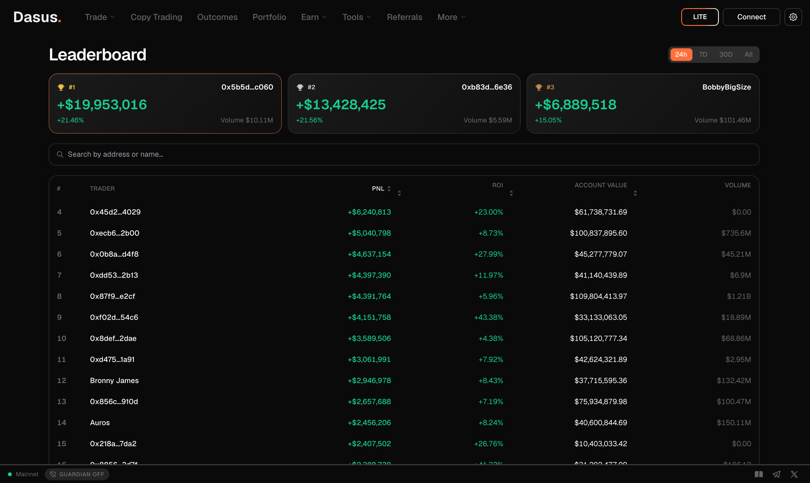

# Leaderboard

The **Leaderboard** ranks the top traders on the underlying protocol by performance. It is live on-chain data — not a Dasus-curated list — so what you see is what those accounts actually did.

## What it shows

The top 100 accounts, with a podium for the top three. Tap any column to re-rank the table:

| Column | What it measures |
| --- | --- |
| **PnL** | Profit and loss over the selected window |
| **ROI** | Return relative to the capital that produced it |
| **Account Value** | Total equity of the account right now |
| **Volume** | Traded notional over the window |

You can also search by address to find a specific account.

## From a name to a strategy

Every row links to that account's page:

- **[Track](explorer.md#track-any-wallet)** — account value, open positions, open orders, PnL and recent activity for that wallet.
- **[Copy Trading](copy-trading.md)** — if the trader has opted in as a leader on Dasus, you can follow them directly from the same view.


**A leaderboard is a ranking, not a recommendation.** High ROI over a short window is often high leverage meeting a favourable market — the same behaviour that produces the biggest drawdowns. Dasus does not vet, endorse or verify any account on this list. Before following anyone, look at how long the record is, how deep its drawdowns were, and how much leverage it used. See [Risk Disclosure](../legal/risk-disclosure.md).


## Related pages

- [Copy Trading](copy-trading.md) — follow a trader automatically, with your own risk limits
- [Explorer & Track](explorer.md) — inspect any wallet's on-chain activity
- [Communities](communities.md) — trade ideas shared by groups you belong to
