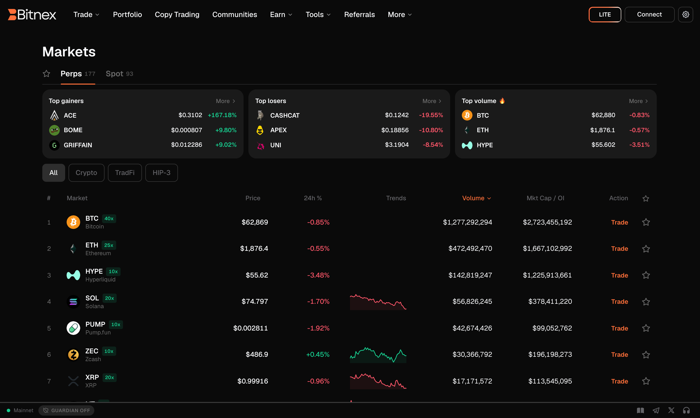

# Markets

The **Markets** page is the catalogue of everything you can trade on Dasus: crypto perpetuals, spot pairs, and TradFi perps (stocks, indices, commodities and FX). It shows live prices, 24h change, volume, open interest and funding, and takes you straight to the terminal for any market you pick.

## What you can trade

| Market type | What it is | Where it trades |
| --- | --- | --- |
| **Crypto perps** | Perpetual futures on BTC, ETH, SOL and hundreds of other assets, with leverage. | Perps order book — [Trading Interface](../trading/interface.md) |
| **Spot** | Buy and hold the asset itself, no leverage and no funding. | [Spot Trading](../trading/spot.md) |
| **TradFi perps** | Perpetual futures on stocks (TSLA, NVDA, AAPL…), indices (SP500, JP225…), commodities (GOLD, SILVER, oil, natural gas) and FX (EURUSD, GBPUSD, JPY). | Same terminal as crypto perps |
| **Outcomes** | Prediction markets — Yes/No shares that settle at 1 or 0 USDC. | [Prediction Markets](../trading/outcomes.md) |


**Stocks, indices, commodities and FX are perpetual futures**, not the underlying share or metal. You never own TSLA stock or physical gold — you take a leveraged position on its price, margined in USDC, with funding like any other perp. They are deployed on Hyperliquid by independent third parties (HIP-3 perp DEXs), each with its own maximum leverage. See [Risk Disclosure](../legal/risk-disclosure.md).


## Finding a market

The page is organised in three panes, each with its own filters:

- **Perps** — every perpetual market. Filter by sector: **Crypto** (AI, DeFi, Gaming, Layer 1, Layer 2, Meme) or **TradFi** (Stocks, Indices, Commodities, FX, Pre-IPO).
- **Spot** — every spot pair quoted in USDC, with market cap where supply data is available.
- **Favorites** — the markets you starred. Click the ★ on any row to add or remove one; favorites follow your wallet across devices.

Use the **search box** to jump straight to a symbol or name, and click any column header to sort — price, 24h change, volume, market cap / open interest, or funding. Clicking a header cycles descending → ascending → back to volume, the table's natural order.

At the top of the table, **Top gainers**, **Top losers** and **Top volume** cards summarise the pane you're in. Hitting **More** on a card sorts the full table by that criterion.

## Reading the table

| Column | Meaning |
| --- | --- |
| **Market** | Symbol and full name. Perp rows show their maximum leverage; TradFi rows show which perp DEX lists them. |
| **Price** | Live mid price, streamed over WebSocket. |
| **24h %** | Change against the previous day's close. |
| **Volume** | 24-hour traded volume in USD — the best single proxy for liquidity. |
| **Mkt Cap / OI** | Market cap for spot tokens; open interest for perps. |
| **Funding 1h** | The current hourly funding rate on perps — see [Funding Rate](../trading/funding-rate.md). |

Spot rows open a **Token details** panel with supply, deployment data, the deployer address and a link to the [Explorer](explorer.md).


**Volume is your liquidity check.** Many listed tokens trade thinly. On a low-volume market, a market order can move the price against you badly — use limit orders, size down, and check the order book before trading anything unfamiliar.


## Heatmap

The **Heatmap** (in the Explore menu) is the same universe seen visually: every market as a tile where **area = 24h volume** (or open interest) and **colour = 24h move**. Tabs split it into All, Crypto, Stocks, Indices, FX, Commodities and Pre-IPO, and you can rank by gainers, losers, volume or open interest.

It is the fastest way to see where the day's activity actually is before you open a chart.

## Related pages

- [Trading Interface](../trading/interface.md) — placing an order once you've picked a market
- [Spot Trading](../trading/spot.md) — how spot differs from perps
- [Prediction Markets](../trading/outcomes.md) — Yes/No outcome markets
- [Fees](fees.md) — what each trade costs
