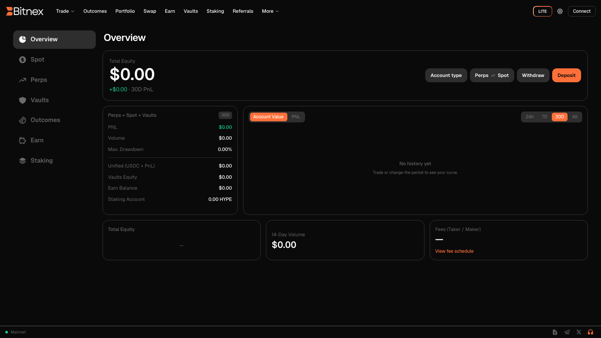

# Portfolio

The **Portfolio** page is your account's home base — a single view of everything you hold and everything you've done on Bitnex. It brings together your total equity, performance over time, balances across every account type, open positions and orders, and a complete ledger of deposits and withdrawals.

Because Bitnex is non-custodial, everything shown here reflects your on-chain state on the underlying protocol — the Portfolio page reads it and presents it in one place. Your funds remain under your control at all times.

## Total equity & PnL chart

At the top of the page you'll find your headline numbers:

- **Total equity** — the combined value of your account across perps, spot, vaults, and staking.
- **PnL over time** — a chart of your profit and loss across a selectable time range, so you can track performance rather than guessing from individual trades.


Unrealized PnL on open positions moves with the mark price and is reflected in your equity in real time. Realized PnL is booked when a position is closed. See [Entry Price & PnL](../trading/entry-price-pnl.md) for how each figure is calculated.


## Balances by account

Your equity is broken down by where it sits:

| Account | What it holds |
| --- | --- |
| **Perps** | Margin and unrealized PnL for perpetual futures positions |
| **Spot** | Spot token balances, tradable or swappable at any time |
| **Vaults** | Value of your deposits in [Vaults](../earn/vaults.md), including your share of vault PnL |
| **Staking** | The protocol's native token you have staked, plus accrued rewards — see [Staking](../earn/staking.md) |

Perps and spot share a **unified balance**, so capital moves freely between the two without manual transfers. To add or remove funds, see [Funding Your Account](funding-account.md).

## Positions, orders & history

The Portfolio page includes the same activity tabs you'll recognize from the trading interface:

- **Positions** — every open position with entry price, mark price, unrealized PnL, margin, and estimated liquidation price.
- **Open orders** — all resting orders across markets, cancellable directly from the table.
- **History** — your past trades, order history, and funding payments, in one chronological record.

This is the fastest way to review exposure across all markets at once, rather than checking each market's page individually. For managing positions in context, see the [Trading Interface](../trading/interface.md).


Keep an eye on the estimated liquidation price of each open position. If margin falls below the maintenance requirement, the position is liquidated by the underlying protocol — see [Liquidation](../trading/liquidation.md).


## Deposits & withdrawals ledger

Every transfer in and out of your account is recorded in the **deposits & withdrawals ledger**:

- USDC deposits bridged in from Arbitrum
- USDC withdrawals sent back to Arbitrum
- Timestamps and amounts for each entry

Because deposits and withdrawals settle on-chain, this ledger corresponds to verifiable on-chain transactions — nothing is hidden inside an internal database.

## Reviewing your activity

Use Portfolio as your record of account activity:

- Audit past trades and fills through the history tabs.
- Reconcile transfers against the deposits & withdrawals ledger.
- Track long-term performance with the PnL chart across different time ranges.
- Export or copy your activity for your own record-keeping — useful for accounting and tax reporting, which remain your responsibility.


Fees paid on each trade are itemized in your trade history. Your current fee tier and the full schedule are available on the [Fees](fees.md) page.


## Related pages

- [Funding Your Account](funding-account.md) — deposits and withdrawals step by step
- [Web Terminal](web-terminal.md) — the Pro trading interface
- [Entry Price & PnL](../trading/entry-price-pnl.md) — how PnL and ROE are calculated
- [Vaults](../earn/vaults.md) and [Staking](../earn/staking.md) — where Earn balances come from
