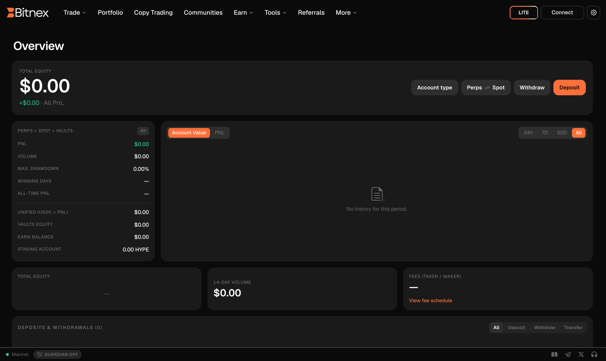

# Portfolio

The **Portfolio** page is your account's home base — total equity, performance over any period, a breakdown of where your capital sits, and every table you need to reconcile what happened.

Because Dasus is non-custodial, everything shown here reflects your on-chain state on the underlying protocol. The Portfolio page reads it and presents it in one place; your funds remain under your control at all times.

## Total equity and performance

At the top you get the headline numbers for the period you select — **24h**, **7D**, **30D** or **All**:

- **Total equity** — everything you hold across perps, spot, vaults, staking, Earn and outcome positions.
- **PnL** for the period, with the equity curve behind it.
- **Volume** traded in the period.
- **Max drawdown** — the worst peak-to-trough fall in the period.
- **Equity breakdown** — how your capital is split across account types.

Deposit, Withdraw and **Perps ⇄ Spot** transfers are one click away from the same header, and your 14-day volume and current taker/maker rates are shown with a link to the full [fee schedule](fees.md).


A return percentage is only shown when it can be measured honestly. If the period has too little history — or deposits and withdrawals leave no reliable starting capital to measure against — Dasus shows the PnL and a dash instead of an invented percentage.


## Sections

The left-hand nav splits your account by where the money actually is. Each section shows its own balance and its own tables:

| Section | What it covers |
| --- | --- |
| **Overview** | Everything at once: equity, breakdown, and the summary tables |
| **Perps** | Perpetual positions, margin and the perps equity curve |
| **Spot** | Spot token balances |
| **Vaults** | Your deposits and PnL in each [vault](../earn/vaults.md) |
| **Outcomes** | Positions in [prediction markets](../trading/outcomes.md) |
| **Earn** | Supplied balances in the [lending markets](../earn/lend-borrow.md) |
| **Staking** | HYPE delegated to validators and accrued rewards — see [Staking](../earn/staking.md) |


**Unified account:** the USDC that backs both perps and spot is counted once — under Perps — so the numbers add up to your real equity instead of double-counting the shared collateral. The Spot section still shows your real spot balance.


## Positions, orders and history

The same activity tables you know from the terminal, across every market at once:

- **Positions** — entry price, mark price, unrealized PnL, margin and estimated liquidation price.
- **Open orders** — every resting order, cancellable from the table.
- **Trading history** — fills, with the fee actually paid on each one.
- **Deposits & withdrawals** — a ledger of every movement in and out, with type, date, amount, transaction reference and net flow.

Because deposits and withdrawals settle on-chain, that ledger corresponds to verifiable on-chain transactions — nothing is hidden in an internal database.


If you are trading as a [sub-account](sub-accounts.md), the page tells you so: the equity at the top is your main account, while the trading tables belong to the account you're currently trading as.


## Reviewing your activity

- Audit past trades and fills through the history tables.
- Reconcile transfers against the deposits & withdrawals ledger.
- Track performance over time with the equity curve and the period selector.
- Open the [PnL Calendar](calendar.md) for the day-by-day view, monthly statistics and your track record.
- Copy or export your activity for your own records — accounting and tax reporting remain your responsibility.


Keep an eye on the estimated liquidation price of each open position. If margin falls below the maintenance requirement, the position is liquidated by the underlying protocol — see [Liquidation](../trading/liquidation.md).


## Related pages

- [PnL Calendar](calendar.md) — daily PnL, monthly stats and your track record
- [Funding Your Account](funding-account.md) — deposits, withdrawals and account types
- [Sub-Accounts](sub-accounts.md) — splitting capital into isolated compartments
- [Entry Price & PnL](../trading/entry-price-pnl.md) — how PnL and ROE are calculated
- [Fees](fees.md) — your tier and what each trade costs
