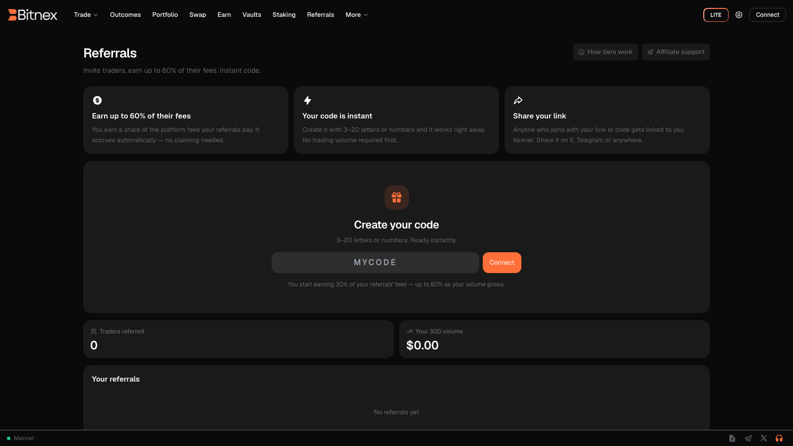

# Referral Program

Earn rewards by bringing new traders to Bitnex. The Referral Program lets you share your personal referral link or code with friends and earn a share of the trading fees they pay — while they can benefit from a fee discount for signing up through you.

## How It Works

1. **Create your referral code** — Head to the Referrals page in the app and create your unique code. Creating a code requires meeting a trading-volume threshold set by the underlying protocol; your progress toward the threshold is shown in the app.
2. **Share your link** — Every code comes with a shareable referral link. Send it to friends, post it to your community, or share it on social media.
3. **They trade, you earn** — When someone connects through your link and trades on Bitnex, you earn a share of the trading fees they generate.
4. **Claim your rewards** — Accrued rewards are visible on the Referrals page and are claimable directly in the app.


The exact reward share and referee discount rates are displayed on the Referrals page in the app. Rates are set by the program and may be updated over time.


## What You Earn

| Role | Benefit |
| --- | --- |
| **Referrer (you)** | A share of the trading fees paid by every user who joins through your link or code |
| **Referee (your friend)** | A discount on their trading fees for joining through a referral |

Rewards accrue automatically as your referred users trade — both on perpetuals and spot markets. There is nothing to configure after the referral is registered.

## Creating Your Code

- Open the **Referrals** page in the app.
- If you haven't yet met the trading-volume threshold, the page shows how much volume you still need. Any trading you do on Bitnex counts toward it — see [Getting Started](../getting-started.md) if you're new.
- Once eligible, choose a custom code (this becomes part of your referral link) and confirm.


Referral codes are registered on-chain by the underlying protocol, so a code generally cannot be changed after it is created. Choose it carefully.


## Tracking & Claiming Rewards

The Referrals page shows everything you need to monitor your program:

- **Your code and link** — copy and share with one click.
- **Referred users** — how many traders have joined through your link.
- **Referred volume** — the total trading volume your referees have generated.
- **Unclaimed rewards** — your accrued fee share, claimable in the app whenever you like.

Claimed rewards are credited to your trading account balance, where you can trade with them or withdraw them like any other funds — see [Funding Your Account](funding-account.md).

## Good to Know

- A user can only be referred once, and typically must enter the code before or shortly after they start trading — the app will indicate whether a code can still be applied.
- Referral rewards are calculated from the fees your referees actually pay. For background on how trading fees work, see [Fees](fees.md).
- Self-referrals are not supported and won't generate rewards.


The bigger and more active your referred community, the more you earn — there is no cap on the number of users you can refer.


## Related Pages

- [Fees](fees.md) — how maker/taker fees and volume tiers work
- [Getting Started](../getting-started.md) — onboarding a new user from zero to first trade
- [Portfolio](portfolio.md) — track balances, PnL and account history
