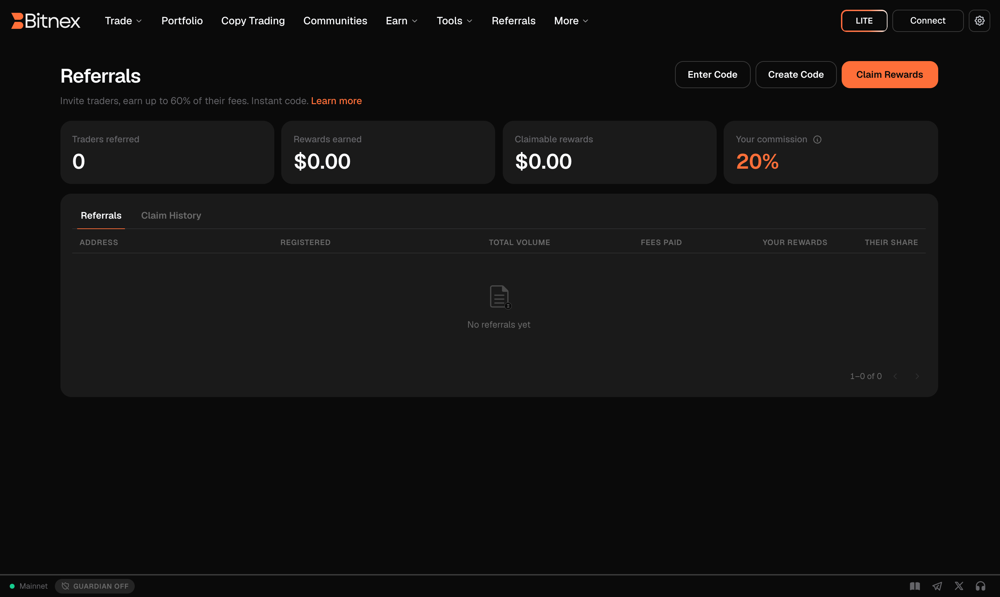

# Referral Program

Invite traders to Dasus and earn a share of the platform fees they generate — from **20% up to 60%**, paid in USDC and claimable whenever you like.

## How it works

1. **Create your code** — open **Referrals**, pick a name (3–20 letters or numbers) and it's live instantly. No trading volume required first.
2. **Share your link** — every code comes with a link. Anyone who joins through it stays linked to you permanently.
3. **They trade, you earn** — you receive a percentage of the Dasus platform fee their trading generates, on perps and spot alike.
4. **Claim** — claim your accrued rewards in USDC straight from the page. They land in your trading balance, ready to trade or withdraw.


Your rewards come out of the **Dasus platform fee** — the share of a trade's cost that Dasus earns. Your invitee is not charged anything extra for joining through you; they pay the same schedule as everyone else. See [Fees](fees.md).


## What you earn

Your share scales with the **30-day trading volume of the people you referred** — not with your own trading. The program rewards bringing traders, not being one:

| Referred 30-day volume | Your share of the platform fee |
| --- | --- |
| $0 | 20% |
| > $1M | 30% |
| > $25M | 40% |
| > $100M | 50% |
| > $500M | 60% |


**Your tier never goes down.** Once you reach a level, it's yours — a quiet month for your referrals doesn't demote you.


The Referrals page shows your current percentage, your referred volume, and how much more is needed to reach the next tier.

## Claiming rewards

- Rewards accrue automatically from on-chain fill data — there is nothing to configure once a referral is registered.
- Claim from the Referrals page at any time. Rewards are paid as **USDC into your trading balance**, where you can trade with them or [withdraw](funding-account.md) them like any other funds.
- There is a small **minimum per claim** (shown on the page) and a daily payout limit. If you hit the daily limit, the remainder stays in your balance and can be claimed the next day.
- **Claim History** lists every payout, with its transaction reference.

## Building a network

An invitee who creates their own code becomes an affiliate in your network. You can pass part of your commission down to them:

- Open the **Their share** control on any referral row and set the percentage of your commission they receive.
- Dasus pays each of you **separately** — you are not paying them out of pocket, and their share is deducted from your own commission before your claimable balance is calculated.
- They can pass part of their share further down, **up to 3 levels**.

Your Referrals page shows both streams: what your direct traders generate, and what comes to you through your sub-affiliates' codes.


Deals above the public 60% ceiling exist for large partners and are agreed individually — they are not part of the automatic tier ladder. Get in touch through the [official channels](../others/official-links.md) if that's you.


## Tracking your referrals

The referrals table lists, for every trader you brought in:

- **Address** and **join date**
- **Total volume** they've traded
- **Fees paid**
- **Your rewards** from them
- **Their share**, if you've set one

You can search, sort and paginate the table, and switch to the **Claim History** tab for your payouts.

## Good to know

- A trader can only be referred **once**, and the code has to be applied when they join — the app shows whether a code can still be applied to an account.
- Self-referrals don't generate rewards.
- Rewards are calculated from the platform fees your referees **actually pay**. For how those fees work, see [Fees](fees.md).
- There is no cap on how many people you can refer.

## Related pages

- [Fees](fees.md) — how maker/taker rates, volume tiers and discounts work
- [Getting Started](../getting-started.md) — what a new invitee has to do to place their first trade
- [Portfolio](portfolio.md) — track balances, PnL and account history
