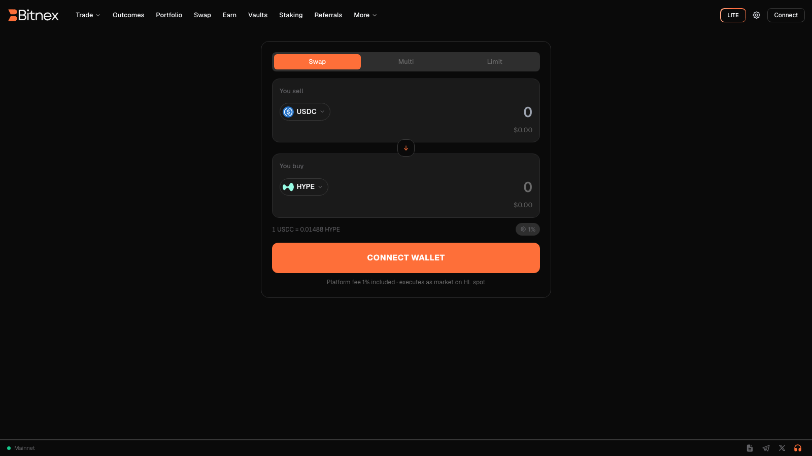

# Swap

Swap is the fastest way to exchange one spot asset for another on Bitnex. Instead of working an order on the Pro terminal, you pick the token you're paying with, the token you want, and confirm — Bitnex handles the routing against the underlying protocol's spot order books for you.

Swaps are executed on the underlying on-chain exchange protocol's spot markets, so you get real order-book liquidity and on-chain settlement — not a synthetic pool price. Your assets remain in your self-custodial trading account at all times.


Swap uses your unified spot balance. If you haven't funded your account yet, see [Funding your account](funding-account.md) first.


## How to swap

1. **Choose your tokens.** Select the token you want to pay with (**From**) and the token you want to receive (**To**). Use the arrow between the two fields to reverse the direction at any time.
2. **Enter an amount.** Type the amount you want to swap, or use the balance shortcut to swap a percentage of your available balance. The estimated amount you'll receive updates in real time.
3. **Review the details.** Before confirming, check the quoted rate and the order details — including the estimated received amount and the fee for the trade. See [Fees](fees.md) for how trading fees work.
4. **Confirm.** Click **Swap** to execute. Because the trade is signed by your agent wallet, there's no wallet popup — the swap settles on-chain within moments. If you haven't enabled trading yet, follow the [Enable Trading](../guides/enable-trading.md) guide.

Your updated balances appear immediately in the Swap interface and in your [Portfolio](portfolio.md).

## Rates and execution

- Quotes are derived from the live spot order books of the underlying protocol, so the rate reflects actual market depth at that moment.
- The final execution price can differ slightly from the quote if the market moves between quoting and execution — larger swaps in thinner markets see more of this effect.
- All costs are displayed in the order details **before** you confirm. There are no hidden charges added after execution.


**Minimum trade sizes apply.** Each spot market on the underlying protocol enforces a minimum order size. If your swap amount is below the minimum, the app will let you know before you confirm. Minimums are shown in-app.


## When to use Swap vs. the Pro terminal

| | Swap | Pro spot trading |
|---|---|---|
| Best for | Quick conversions between spot assets | Precise entries with limit orders |
| Order type | Market execution at the quoted rate | Full [order types](../trading/order-types.md), order book, charts |
| Interface | Two fields and a confirm button | Full [trading terminal](web-terminal.md) |

If you want to set an exact price, work passive limit orders, or watch the book while you trade, use the spot markets on the [Pro terminal](web-terminal.md) instead.

## FAQ

**Do I pay gas for swaps?**
No. Like all trading on Bitnex, swaps are gasless once trading is enabled — see [Enable Trading](../guides/enable-trading.md).

**Which tokens can I swap?**
Any asset listed on the underlying protocol's spot markets. The token selector shows everything available, along with your current balances.

**Where do my swapped tokens go?**
Straight into your unified spot balance. You can view them in your [Portfolio](portfolio.md), trade them on the terminal, or withdraw per [Funding your account](funding-account.md).
