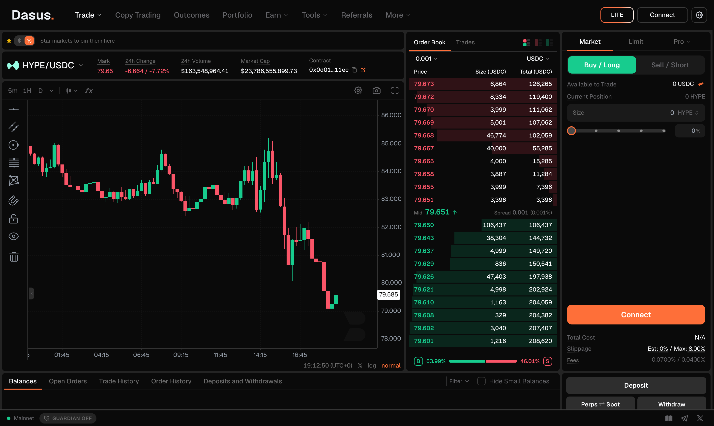

# Spot Trading

Spot trading means buying the asset itself: no leverage, no funding payments and no liquidation. You send USDC, you get the token; you sell the token, you get USDC back. Spot markets live on the same on-chain order book as perps, and you trade them from the same terminal.

## Spot vs. perps

| | Spot | Perps |
| --- | --- | --- |
| **What you hold** | The token itself | A position on the price |
| **Leverage** | None | Up to the market's maximum |
| **Funding** | None | Paid or received every hour — see [Funding Rate](funding-rate.md) |
| **Liquidation** | Not possible | Possible if margin falls below maintenance — see [Liquidation](liquidation.md) |
| **Can go short** | No | Yes |
| **Risk of loss** | Limited to what you paid | Can exceed your initial margin at high leverage |


Spot is the right tool when you want to hold an asset, and perps when you want leverage, shorts, or exposure without holding the token. Both share the same balance — see below.


## One balance for both

With the default **Unified** account type, a single USDC balance backs everything: crypto perps, TradFi perps and spot. Buying spot doesn't require transferring anything first, and selling puts the USDC straight back where your margin comes from.

You can change this from the **Account Type** control in the order form — see [Funding Your Account](../platform/funding-account.md#account-type).

## Placing a spot trade

1. Open **Spot** from the navigation, or pick any spot pair from [Markets](../platform/markets.md).
2. Choose **Buy** or **Sell**.
3. Enter the size — in the token or in USD.
4. Pick an order type. Spot supports **Market**, **Limit** (with GTC / IOC / Post Only), **Scale**, **TWAP** and **Chase** — see [Order Types](order-types.md).
5. Review Order Details, including the exact fee, and confirm. No wallet popup, no gas.

Your spot balances appear in **Portfolio → Spot**, and every fill lands in your trade history.


**Check the pair before you trade.** Some spot symbols are bridged or wrapped versions of the asset you have in mind, and many tokens list with very little volume. Look at the 24h volume and the order book first: on a thin book a market order can fill far away from the price you saw.


## Swapping instead

If you just want to convert one token into another without thinking about order books, use [Swap](../platform/swap.md). It routes through the same spot markets in one click. Swap is built for convenience; placing your own limit order on the spot book gives you price control and a lower fee.

## Fees

Spot trades pay the spot maker/taker schedule, which is higher than the perps schedule — that is standard across the industry and it applies to the protocol's base fee as well as the Dasus platform fee. Post Only (maker) orders pay materially less. The exact rate for your order is always shown before you confirm; the full schedule lives on the [Fees](../platform/fees.md) page.

## Related pages

- [Markets](../platform/markets.md) — browse every spot pair
- [Order Types](order-types.md) — Market, Limit, Scale, TWAP, Chase
- [Swap](../platform/swap.md) — one-click conversions
- [Portfolio](../platform/portfolio.md) — where your spot balances show up
